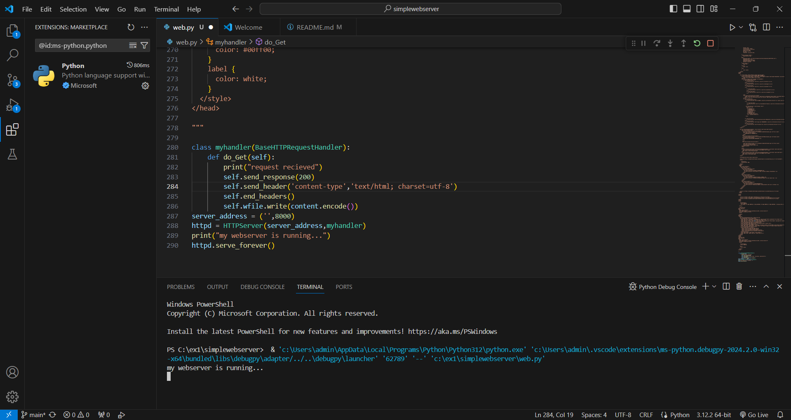

# EX01 Developing a Simple Webserver
## Date:

## AIM:
To develop a simple webserver to serve html pages.

## DESIGN STEPS:
### Step 1: 
HTML content creation.

### Step 2:
Design of webserver workflow.

### Step 3:
Implementation using Python code.

### Step 4:
Serving the HTML pages.

### Step 5:
Testing the webserver.

## PROGRAM:
```
from http.server import HTTPServer, BaseHTTPRequestHandler
content = """
<!DOCTYPE html>
<html lang="en">
<head>
    <meta charset="UTF-8">
    <meta name="viewport" content="width=device-width, initial-scale=1.0">
    <title>SEC</title>
    <link rel="stylesheet" href="https://stackpath.bootstrapcdn.com/bootstrap/4.5.2/css/bootstrap.min.css">
    <link rel="stylesheet" href="https://cdn.jsdelivr.net/npm/bootstrap-icons@1.11.3/font/bootstrap-icons.min.css">
    
    <style>
        .carousel-item img {
            max-width: 75%;
            height: auto;
            margin: 0 auto; 
            
        }
        .carousel-caption
        {
            color: antiquewhite;
            font-family: 'Gill Sans', 'Gill Sans MT', Calibri, 'Trebuchet MS', sans-serif;
            background-color: transparent;
        }
        .button-container:hover {

    background-color:whitesmoke ;
     
        }
 .button-container {
            display: flex;
            flex-direction: column;
            justify-content: flex-start;
            margin-left: 20px; 
            position: absolute; 
            top: 50%; 
            transform: translateY(-50%);
            
        }
        .button-container button {
            margin-bottom: 10px; 
        }
        body {
            background-image: url('abstract-digital-grid-black-background_53876-97647.avif'); 
            background-size: cover;
            background-repeat: no-repeat;
            background-attachment: fixed;
            position: relative; 
        }
        .navbar-toggler {
            order: -1; 
        }
        .button{
            color: gray;
        }
        .text
        {
            color: white;
        }
    </style>
</head>
<body>

    <nav class="navbar navbar-expand-lg navbar-light bg-light">
        <a class="navbar-brand" href="#">KAVIN EVENT PLANNERS</a>
        <button class="navbar-toggler" type="button" data-toggle="collapse" data-target="#navbarNav" aria-controls="navbarNav" aria-expanded="false" aria-label="Toggle navigation">
            <span class="navbar-toggler-icon"></span>
        </button>
        <div class="collapse navbar-collapse" id="navbarNav">
            <ul class="navbar-nav mr-auto">
                <li class="nav-item">
                    <a class="nav-link" href="#"><i class="bi bi-twitter"></i></a>
                </li>
                <li class="nav-item">
                    <a class="nav-link" href="#"><i class="bi bi-whatsapp"></i></a>
                </li>
                <li class="nav-item">
                    <a class="nav-link" href="#"><i class="bi bi-youtube"></i></a>
                </li>
                
                    <li class="nav-item">
                        <a class="nav-link" href="#"><i class="bi bi-pinterest"></i></a>
                    </li>
                    <li class="nav-item">
                        <a class="nav-link" href="#"><i class="bi bi-facebook"></i></a>
                    </li>
                
            </ul>
            <form class="form-inline my-2 my-lg-0">
                <input class="form-control mr-sm-2" type="search" placeholder="search Events" aria-label="Search">
                <button class="btn btn-outline-success my-2 my-sm-0" type="submit">Search</button>
            </form>
            <ul class="navbar-nav">
                <li class="nav-item active">
                    <a class="nav-link" href="#">ABOUT<i class="bi bi-three-dots-vertical"></i> <span class="sr-only">(current)</span></a>
                </li>
            
                    <li class="nav-item">
                      <a class="nav-link" href="#" id="eventsButton">Events<i class="bi bi-three-dots-vertical"></i></a>
                    </li>
                  
                  <div id="eventsList" style="display: none;">
                    <h2>Events:</h2>
                    <ul>
                      <li>MARRIAGE</li>
                      <li>BIRTHDAY</li>
                      <li>GETTOGETHER</li>
                      <li>Party</li>
                      <li>RECEPTION </li>
                      <li>Weddings</li>
                     <li> Birthday parties</li>
                      <li>  Corporate events</li>
                       
                  </div>
                
                 
                <li class="nav-item">
                    <a class="nav-link" href="infrastracture.html">SPECIALITY<i class="bi bi-three-dots-vertical"></i></a> 
                </li>
                <li class="nav-item">
                    <a class="nav-link" href="login.html">MANAGEMENT<i class="bi bi-three-dots-vertical"></i></a>
                </li>
                <li class="nav-item">
                    <a class="nav-link" href="#">Contact Us<i class="bi bi-three-dots-vertical"></i></a>
                </li>
            </ul>
        </div>
    </nav>

    <div id="carouselExampleSlidesOnly" class="carousel slide" data-ride="carousel">
        <div class="carousel-inner">
          <div class="carousel-item active text-center">
            
            <div class="carousel-caption">
                <p>DAZZLING DJ'S OVERNIGHT</p>
            </div>
          </div>
          <div class="carousel-item text-center"> 
            
          <div class="carousel-caption">
            <p>THE TASTE YOU HAVE NEVER EXPERIENCED </p>
          </div>
            
          </div>
          <div class="carousel-item text-center"> 
        
            
            <div class="carousel-caption">
            <p>Entertaining standup comedy's</p>
        </carousel-caption>  
        </div>

        </div>
        <a class="carousel-control-prev" href="#carouselExampleSlidesOnly" role="button" data-slide="prev">
          <span class="carousel-control-prev-icon" aria-hidden="true"></span>
          <span class="sr-only">Previous</span>
        </a>
        <a class="carousel-control-next" href="#carouselExampleSlidesOnly" role="button" data-slide="next">
          <span class="carousel-control-next-icon" aria-hidden="true"></span>
          <span class="sr-only">Next</span>
        </a>
    </div>

    <title>Bootstrap Cards Side by Side</title>
    
    <link href="https://stackpath.bootstrapcdn.com/bootstrap/4.5.2/css/bootstrap.min.css" rel="stylesheet">
    <style>
      
      .custom-card {
        margin-bottom: 20px;
      }
    </style>
  </head>
  <body>
    <div class="container">
      <div class="row">
        <div class="col-md-4">
          <div class="card custom-card">
            <div class="card-body">
              <h5 class="card-title">BIRTHDAY PACKAGE@5999</h5>
              <p class="card-text">"From candles to cake, we make birthdays unforgettable."</p>
            </div>
          </div>
        </div>
        <div class="col-md-4">
          <div class="card custom-card">
            <div class="card-body">
              <h5 class="card-title">MARRIAGE PACKAGE @ 500000 </h5>
              <p class="card-text">"Creating unforgettable moments for your special day.".</p>
            </div>
          </div>
        </div>
        <div class="col-md-4">
          <div class="card custom-card">
            <div class="card-body">
              <h5 class="card-title">GETTOGETHER@59999</h5>
              <p class="card-text">"Gathering together, making memories that last a lifetime."</p>
            </div>
          </div>
        </div>
      </div>
    </div>
  
    
    <script src="https://stackpath.bootstrapcdn.com/bootstrap/4.5.2/js/bootstrap.min.js"></script>
  </body>
  </html>
  
</body>
</html>

    <script src="https://code.jquery.com/jquery-3.5.1.slim.min.js"></script>
    <script src="https://cdn.jsdelivr.net/npm/@popperjs/core@2.9.2/dist/umd/popper.min.js"></script>
    <script src="https://stackpath.bootstrapcdn.com/bootstrap/4.5.2/js/bootstrap.min.js"></script>
</body>
</html>
<style>
   
    .glowing-green {
      color: #00ff00; 
      text-shadow: 0 0 10px #00ff00, 0 0 20px #00ff00, 0 0 40px #00ff00, 0 0 80px #00ff00; /* Glowing effect */
    }
  </style>
  
  <!DOCTYPE html>
<html lang="en">
<head>
  <meta charset="UTF-8">
  <meta name="viewport" content="width=device-width, initial-scale=1.0">
  <title>Form Submission</title>
  <style>
    
  </style>
</head>
<body>
  <center>
    <h1 class="glowing-green">Tell us about you!</h1>
    <form method="post" action="submit.php">
      <input type="text" minlength="3" maxlength="20" required name="fname" placeholder="First Name"/><br/>
      <input type="text" name="lname" placeholder="Last Name"/><br/>
      <input type="tel" pattern="[0-9]{10}" name="phone_number" placeholder="Phone Number" maxlength="10" minlength="10"/><br/>
      <input type="email" name="email" placeholder="Email"/><br/>
      <b class="glowing-green">DATE OF THE EVENT</b><br/>
      <input type="date" name="date_of_event" placeholder="Date of Event"/><br/>
      <b class="glowing-green">GENDER:</b><br/>
      <input type="radio" name="gender" value="male" id="male"/><label for="male">Male </b></style></label><br/>
      <input type="radio" name="gender" value="female" id="female"/><label for="female">Female</label><br/>
      <b class="glowing-green">Events</b><br/>
      <select name="event" id="events">
        <option value="marriage">Marriage</option>
        <option value="birthday">Birthday</option>
        <option value="get_together">Get-together</option>
        <option value="bachelor_party">Bachelor Party</option>
      </select><br/><br/>
      <input type="submit" name="submit" value="Submit"/>
      <input type="reset" name="clear_all" value="Clear All"/>
    </form>
  </center>
</body>
</html>
<!DOCTYPE html>
<html lang="en">
<head>
  <meta charset="UTF-8">
  <meta name="viewport" content="width=device-width, initial-scale=1.0">
  <title>Form Submission</title>
  <style>
    
    .glowing-green {
      color: #00ff00; 
    }
    label {
      color: white;
    }
  </style>
</head>

"""

class myhandler(BaseHTTPRequestHandler):
    def do_Get(self):
        print("request recieved")
        self.send_response(200)
        self.send_header('content-type','text/html; charset=utf-8')
        self.end_headers()
        self.wfile.write(content.encode())
server_address = ('',8000)
httpd = HTTPServer(server_address,myhandler)
print("my webserver is running...")
httpd.serve_forever()
```

## OUTPUT:


## RESULT:
The program for implementing simple webserver is executed successfully.
